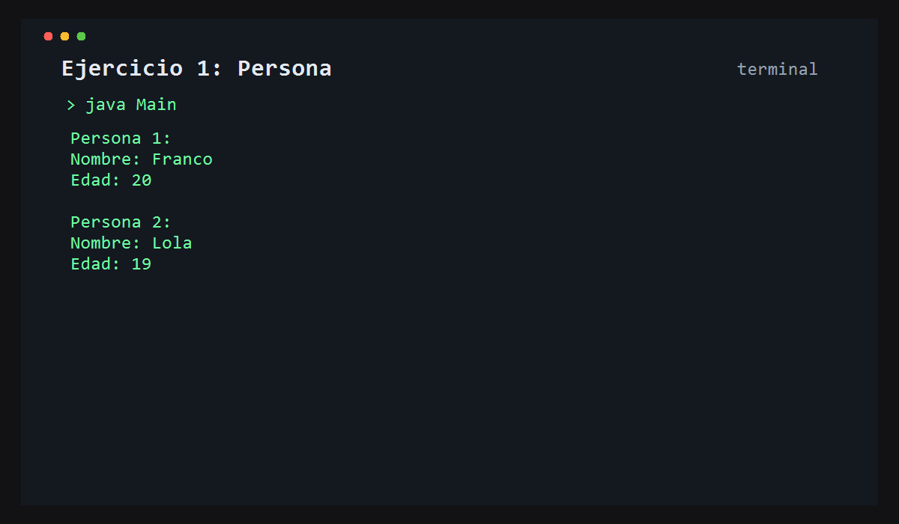

# Ejercicio 1: Persona

    /------------------------------------------\
    | Modelado de datos personales            |
    \------------------------------------------/

## Descripción

Este ejercicio modela una clase `Persona` con atributos como nombre y edad, y luego crea dos instancias para representar dos personas distintas.

## Objetivo

Practicar la creación de clases, atributos y objetos en Java, además de entender cómo se trabaja con datos de instancia.

## Como funciona

La clase `Persona` define los datos básicos de una persona. En la clase `Main` se crean dos objetos, se les asignan valores y luego se muestran en consola.



## Lógica aplicada

- Declaración de una clase
- Definición de atributos
- Instanciación de objetos
- Asignación de valores
- Impresión de datos por consola

## Código principal

```java
Persona persona1 = new Persona();
persona1.nombre = "Franco";
persona1.edad = 20;
```

## Ejecución

```bash
javac src/*.java
java -cp src Main
```


