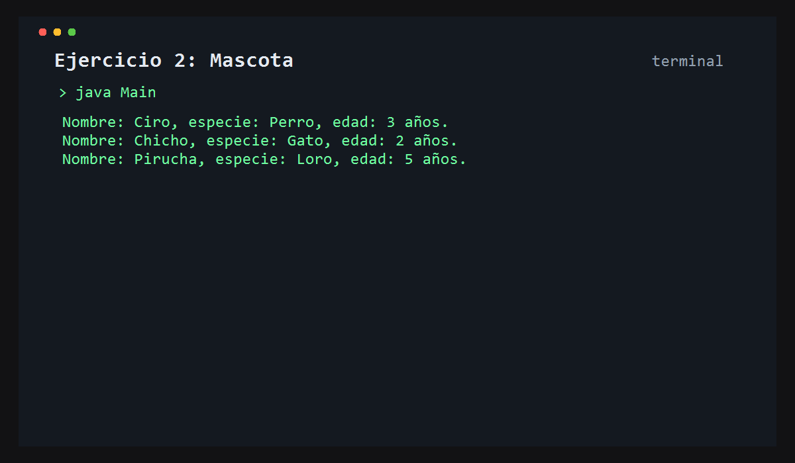

# Ejercicio 2: Mascota

## Descripción

Este ejercicio crea una clase `Mascota` con nombre, especie y edad, usando un constructor para inicializar sus valores.

## Objetivo

Aprender a trabajar con constructores y objetos con datos específicos.

## Funcionamiento

Se crean tres mascotas con distintos nombres, especies y edades, y luego se muestran en consola.



## Lógica aplicada

- Constructor de clase
- Atributos de instancia
- Creación de múltiples objetos
- Formateo de salida

## Código principal

```java
Mascota mascota1 = new Mascota("Ciro", "Perro", 3);
System.out.println("Nombre: " + mascota1.nombre + ", especie: " + mascota1.especie + ", edad: " + mascota1.edad + " años.");
```