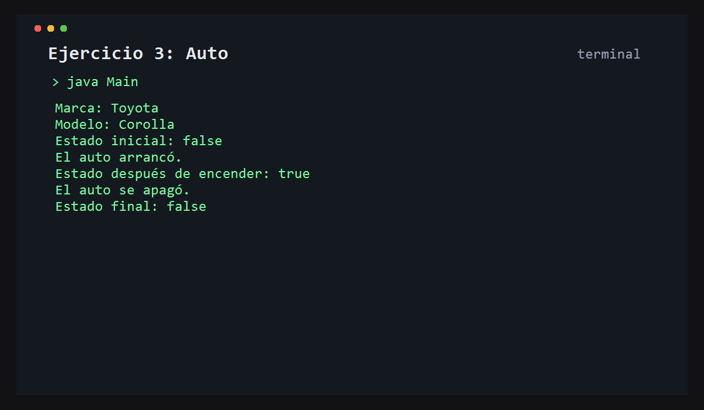

# Ejercicio 3: Auto

    /------------------------------------------\
    | Estado del vehículo                     |
    \------------------------------------------/

## Descripción

Este ejercicio modela un auto con atributos para su marca, modelo y un estado que indica si está encendido o apagado.

## Objetivo

Comprender cómo manejar estados dentro de una clase y cómo utilizar métodos para modificar el comportamiento de un objeto.

## Como funciona

Se crea un objeto `Auto`, se consulta su estado inicial, luego se enciende y se vuelve a verificar. Finalmente, el vehículo se apaga.



## Lógica aplicada

- Clases y objetos
- Atributos de instancia
- Constructores
- Métodos para cambiar el estado
- Uso de booleanos

## Código principal

```java
Auto auto = new Auto("Toyota", "Corolla");
auto.encender();
auto.apagar();
```

## Ejecución

```bash
javac src/*.java
java -cp src Main
```
