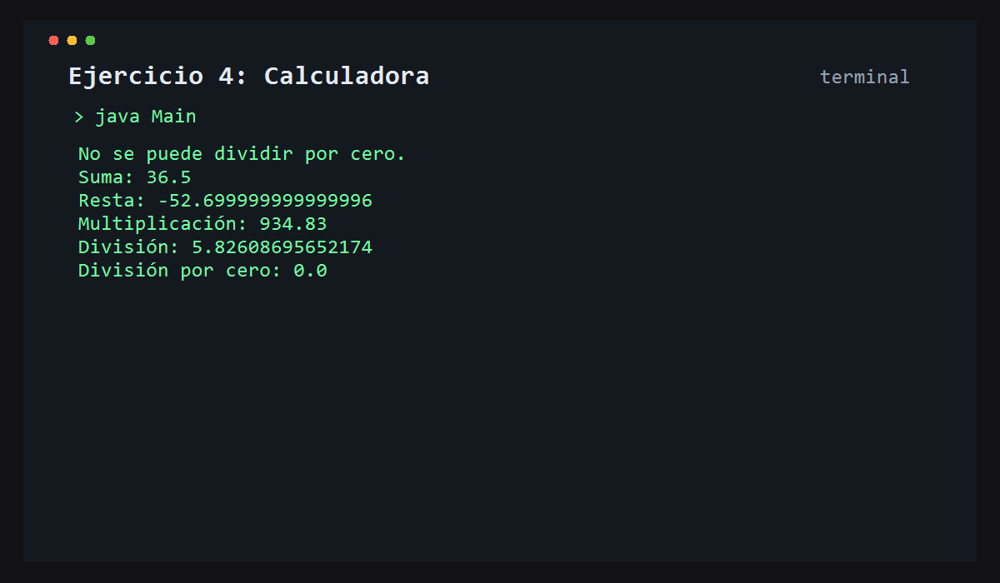

# Ejercicio 4: Calculadora

    /------------------------------------------\
    | Operaciones matemáticas                 |
    \------------------------------------------/

## Descripción

Este ejercicio implementa una calculadora con operaciones básicas: suma, resta, multiplicación y división.

## Objetivo

Practicar métodos con parámetros y uso de valores devueltos, además de controlar casos especiales como la división por cero.

## Como funciona

Se crea una instancia de `Calculadora`, se invocan varios métodos y se muestran los resultados en pantalla.



## Lógica aplicada

- Métodos con parámetros
- Retorno de resultados
- Validación de errores
- Operaciones aritméticas

## Código principal

```java
Calculadora calculadora = new Calculadora();
double suma = calculadora.sumar(12.4, 24.1);
double division = calculadora.dividir(13.4, 2.3);
```

## Ejecución

```bash
javac src/*.java
java -cp src Main
```
