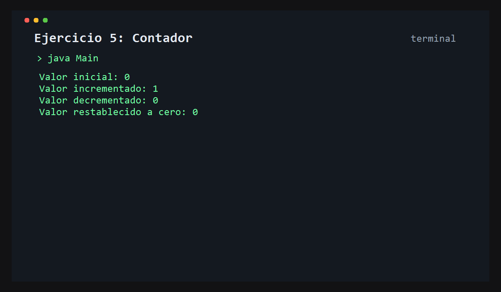

# Ejercicio 5: Contador

    /------------------------------------------\
    | Control de estado                       |
    \------------------------------------------/

## Descripción

Este ejercicio representa un contador con capacidad de aumentar, disminuir y reiniciar su valor.

## Objetivo

Entender cómo una clase mantiene un estado interno y cómo se modifican sus valores mediante métodos.

## Como funciona

Se crea un objeto `Contador`, se muestra su valor inicial, luego se incrementa, se decrementa y finalmente se resetea a cero.



## Lógica aplicada

- Estado interno de un objeto
- Métodos de modificación
- Validación para no bajar de cero
- Reinicio del valor

## Código principal

```java
Contador contador = new Contador();
System.out.println(contador.incrementar());
System.out.println(contador.decrementar());
System.out.println(contador.resetear());
```

## Ejecución

```bash
javac src/*.java
java -cp src Main
```
