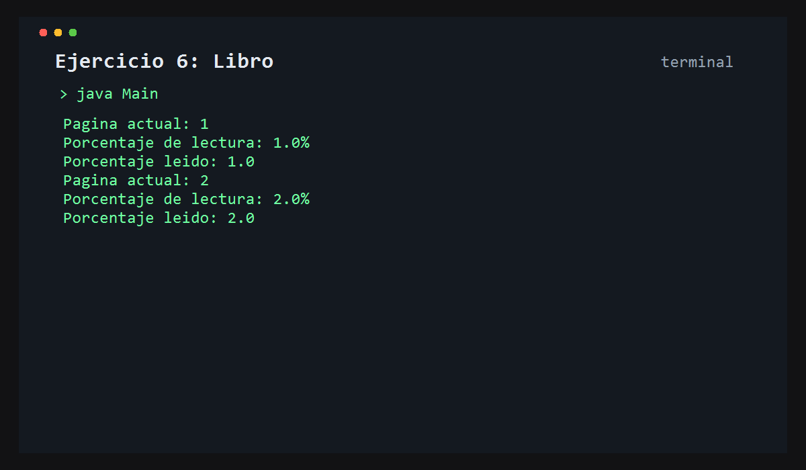

# Ejercicio 6: Libro

    /------------------------------------------\
    | Progreso de lectura                     |
    \------------------------------------------/

## Descripción

Este ejercicio modela un libro con una cantidad total de páginas y un progreso de lectura que se va avanzando.

## Objetivo

Aprender a representar un estado progresivo dentro de un objeto y calcular porcentajes a partir de ese estado.

## Como funciona

Se instancia un libro con 100 páginas, se lee progresivamente y se imprime el avance actual y el porcentaje leído.



## Lógica aplicada

- Atributos para el estado del libro
- Métodos para avanzar lectura
- Cálculo de porcentaje
- Control de fin de lectura

## Código principal

```java
Libro libro1 = new Libro(100);
System.out.println("Pagina actual: " + libro1.leerPaginas());
System.out.println("Porcentaje leido: " + libro1.mostrarProgreso());
```

## Ejecución

```bash
javac src/*.java
java -cp src Main
```
