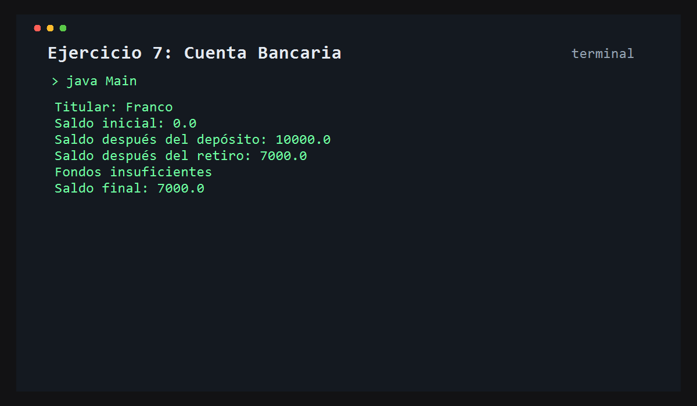

# Ejercicio 7: Cuenta Bancaria

    /------------------------------------------\
    | Seguridad de saldo                      |
    \------------------------------------------/

## Descripción

Este ejercicio representa una cuenta bancaria con titular, saldo y operaciones básicas de depósito y retiro.

## Objetivo

Trabajar con encapsulamiento y controlar el saldo de una cuenta de forma segura y ordenada.

## Como funciona

Se crea una cuenta, se asigna el titular, se deposita dinero, se retira y se valida que no se puedan sacar más fondos de los disponibles.



## Lógica aplicada

- Encapsulamiento
- Getters y setters
- Validación de saldo
- Operaciones bancarias

## Código principal

```java
CuentaBancaria cuenta1 = new CuentaBancaria();
cuenta1.setTitular("Franco");
cuenta1.depositar(10000);
cuenta1.retirar(3000);
```

## Ejecución

```bash
javac src/*.java
java -cp src Main
```
