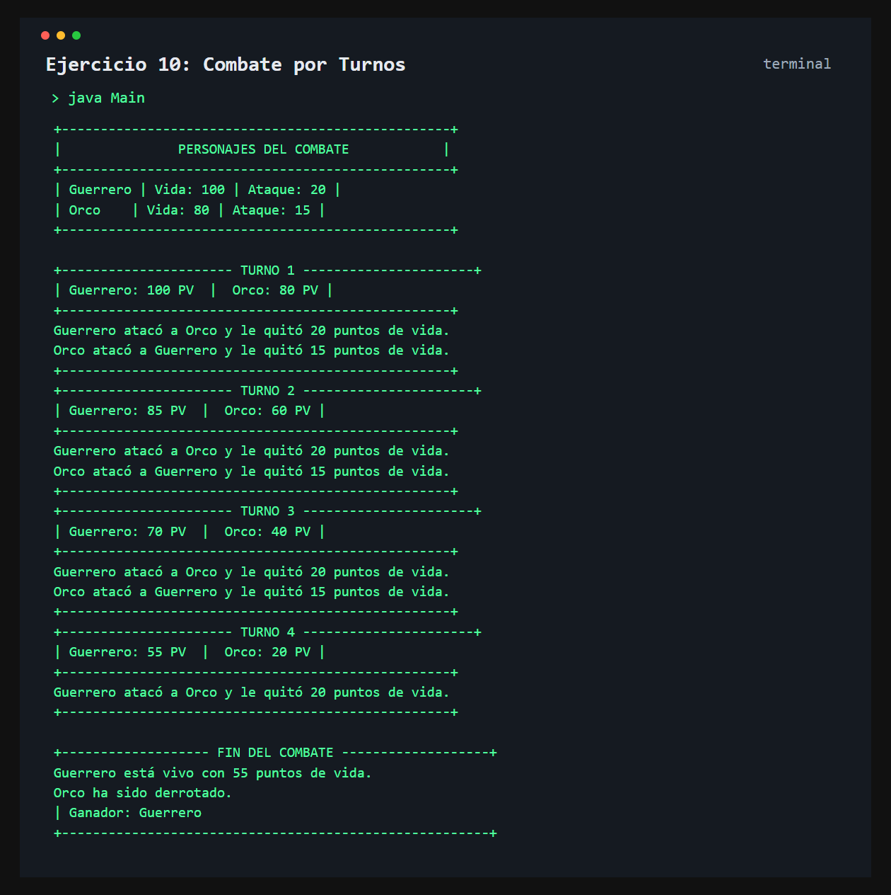

# Ejercicio 10: Combate por Turnos

    /------------------------------------------\
    | Simulación de combate                    |
    \------------------------------------------/

## Descripción

Este ejercicio simula un combate entre dos personajes. Cada personaje tiene puntos de vida y puntos de ataque.

## Objetivo

Practicar la interacción entre objetos y el uso de ciclos y condiciones para controlar un combate por turnos.

## Como funciona

Se crean dos personajes y se muestran sus atributos iniciales. En cada turno, el primero ataca; el segundo responde solo si todavía tiene vida. El combate continúa hasta que uno de los dos es derrotado y luego se anuncia el ganador.



## Lógica aplicada

- Clases, atributos y constructores
- Interacción entre objetos mediante el método `atacar()`
- Ciclo `while` para repetir los turnos
- Condicional para evitar que un personaje derrotado ataque
- Método `estaVivo()` para informar el estado final

## Código principal

```java
Personaje jugador1 = new Personaje("Guerrero", 100, 20);
Personaje jugador2 = new Personaje("Orco", 80, 15);

while (jugador1.puntosDeVida > 0 && jugador2.puntosDeVida > 0) {
    jugador1.atacar(jugador2);
    if (jugador2.puntosDeVida > 0) {
        jugador2.atacar(jugador1);
    }
}
```

## Ejecución

```bash
javac src/*.java
java -cp src Main
```