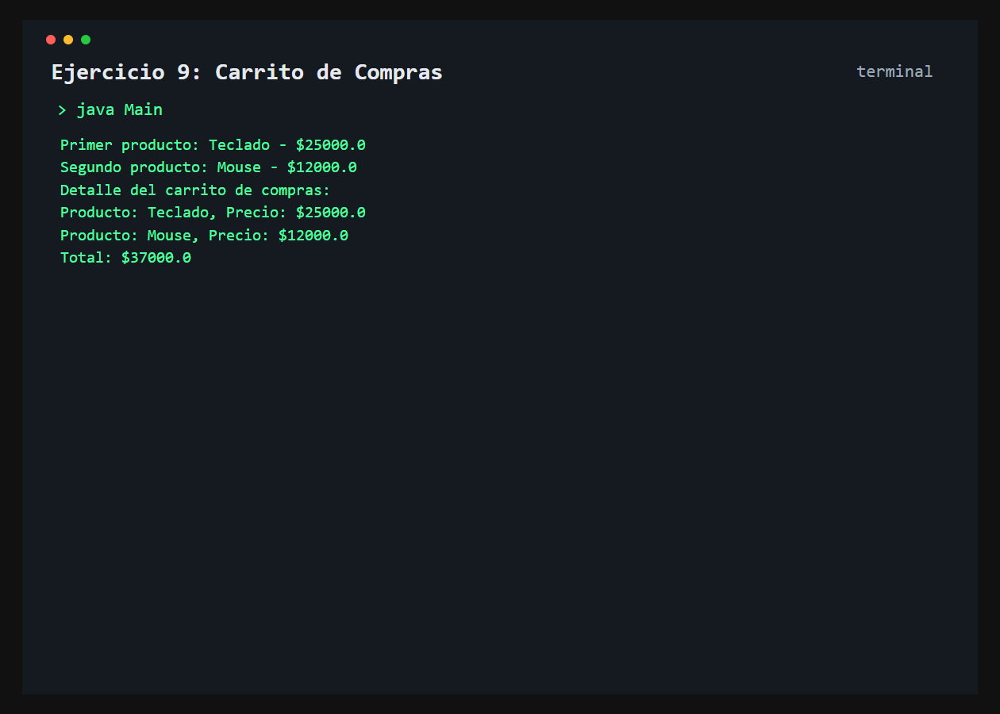

# Ejercicio 9: Carrito de Compras

    /------------------------------------------\
    | Productos y total de compra              |
    \------------------------------------------/

## Descripción

Este ejercicio representa productos con nombre y precio, y permite agregarlos a un carrito de compras.

## Objetivo

Practicar encapsulamiento, colecciones y recorridos de listas para calcular el total de una compra.

## Como funciona

La clase `Producto` mantiene privados su nombre y precio. El carrito guarda los productos en un `ArrayList`, muestra su detalle y acumula sus precios para obtener el total.



## Lógica aplicada

- Encapsulamiento de atributos
- Getters y setters
- Validación para evitar precios negativos
- Uso de `ArrayList`
- Recorrido de productos y acumulación del total

## Código principal

```java
Producto teclado = new Producto();
teclado.setNombre("Teclado");
teclado.setPrecio(25000);

CarritoDeCompras carrito = new CarritoDeCompras();
carrito.agregarProducto(teclado);
carrito.mostrarDetalle();
System.out.println(carrito.calcularTotal());
```

## Ejecución

```bash
javac src/*.java
java -cp src Main
```