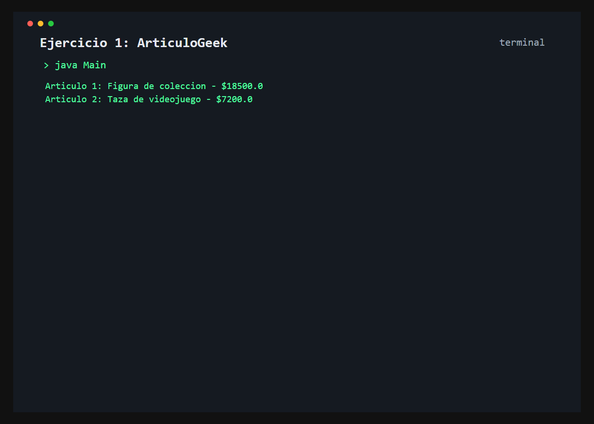

# Ejercicio 1: ArticuloGeek

    /------------------------------------------\
    | Modelado e instanciacion                 |
    \------------------------------------------/

## Descripción

Se modelan articulos geek mediante una clase con nombre y precio base. El programa crea dos objetos independientes y asigna directamente sus atributos.

## Objetivo

Practicar la declaracion de clases, la instanciacion con `new` y el acceso a atributos con el operador punto.

## Como funciona

En `Main` se crean dos instancias de `ArticuloGeek`, se asignan sus datos y se muestran por consola.



## Lógica aplicada

- Clase con atributos de instancia
- Instanciacion de objetos con `new`
- Acceso directo a atributos mediante `.`

## Código principal

```java
ArticuloGeek articulo = new ArticuloGeek();
articulo.nombre = "Figura de coleccion";
articulo.precioBase = 18500.0;
System.out.println(articulo.nombre + " - $" + articulo.precioBase);
```

## Ejecución

```bash
javac src/*.java
java -cp src Main
```