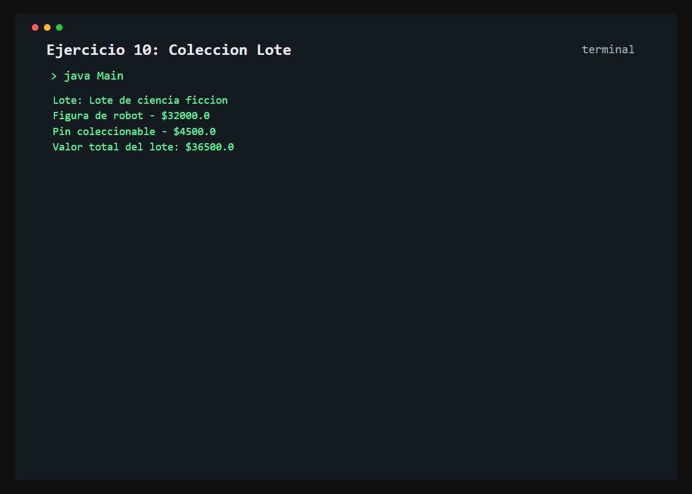

# Ejercicio 10: ColeccionLote

    /------------------------------------------\
    | Agregacion de articulos                  |
    \------------------------------------------/

## Descripción

Una coleccion lote agrupa dos articulos geek independientes y permite mostrar su detalle y valor total.

## Objetivo

Modelar una relacion de agregacion usando referencias a objetos como atributos de otra clase.

## Como funciona

Se crean dos articulos, se agrupan en una `ColeccionLote` y se invoca el metodo que muestra los articulos y suma sus precios.



## Lógica aplicada

- Atributos privados y getters en `ArticuloGeek`
- Agregacion de dos articulos en `ColeccionLote`
- Calculo del valor del lote mediante mensajes a los objetos asociados
- Presentacion del detalle individual y total

## Código principal

```java
ArticuloGeek principal = new ArticuloGeek("Figura de robot", 32000.0);
ArticuloGeek secundario = new ArticuloGeek("Pin coleccionable", 4500.0);
ColeccionLote lote = new ColeccionLote("Lote de ciencia ficcion", principal, secundario);
lote.mostrarDetalleLote();
```

## Ejecución

```bash
javac src/*.java
java -cp src Main
```