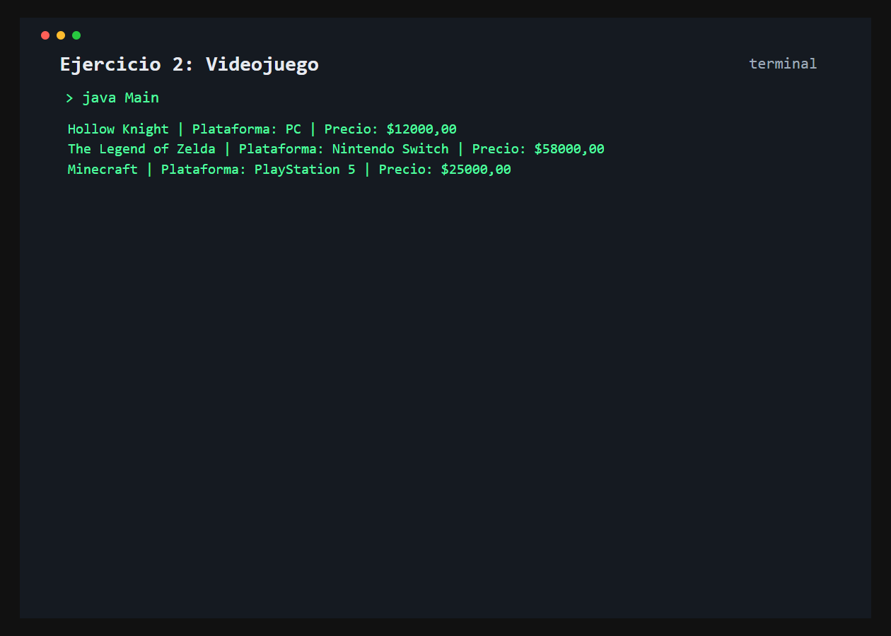

# Ejercicio 2: Videojuego

    /------------------------------------------\
    | Inicializacion con constructor           |
    \------------------------------------------/

## Descripción

La clase `Videojuego` representa juegos con titulo, plataforma y precio, inicializados al crear cada objeto.

## Objetivo

Usar un constructor parametrizado y la referencia `this` para inicializar el estado de cada instancia.

## Como funciona

Se crean tres videojuegos con el constructor y se imprime la descripcion de cada uno usando `String.format()`.



## Lógica aplicada

- Constructor parametrizado
- Uso de `this`
- Encapsulamiento y getters
- Formateo de texto con `String.format()`

## Código principal

```java
Videojuego juego = new Videojuego("Hollow Knight", "PC", 12000.0);
System.out.println(String.format("%s | Plataforma: %s | Precio: $%.2f",
        juego.getTitulo(), juego.getPlataforma(), juego.getPrecio()));
```

## Ejecución

```bash
javac src/*.java
java -cp src Main
```