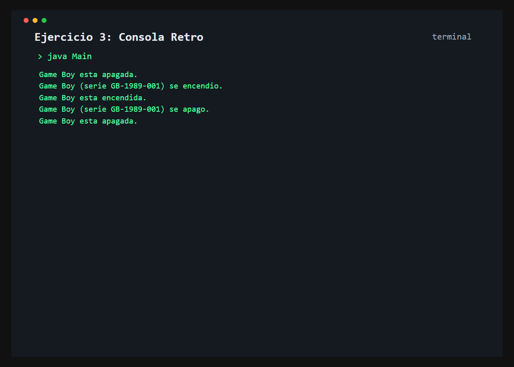

# Ejercicio 3: Consola Retro

    /------------------------------------------\
    | Transicion de estados                    |
    \------------------------------------------/

## Descripción

Una consola retro conserva su modelo, numero de serie y estado de encendido.

## Objetivo

Practicar metodos `void` que modifican el estado de un objeto y comunican el cambio.

## Como funciona

El programa muestra el estado inicial, enciende la consola, vuelve a consultar su estado, la apaga y confirma el estado final.



## Lógica aplicada

- Atributo booleano inicializado en `false`
- Constructor parametrizado
- Metodos de instancia `encender()` y `apagar()`
- Condicional `if`/`else` para mostrar el estado

## Código principal

```java
ConsolaRetro consola = new ConsolaRetro("Game Boy", "GB-1989-001");
consola.mostrarEstado();
consola.encender();
consola.mostrarEstado();
consola.apagar();
```

## Ejecución

```bash
javac src/*.java
java -cp src Main
```