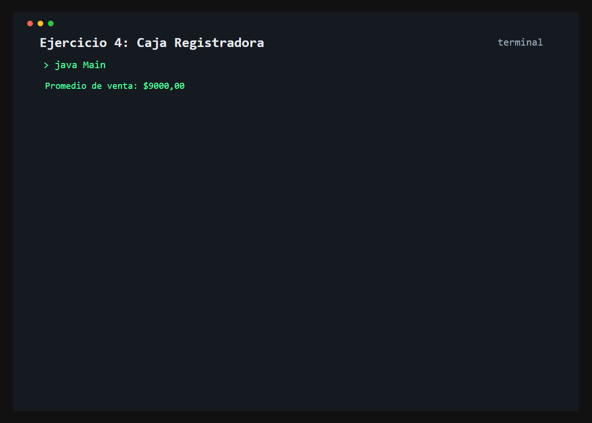

# Ejercicio 4: Caja Registradora

    /------------------------------------------\
    | Registro y promedio de ventas            |
    \------------------------------------------/

## Descripción

La caja registradora acumula los importes de las ventas y mantiene la cantidad de operaciones realizadas.

## Objetivo

Implementar metodos que actualizan atributos y devuelven resultados mediante `return`, contemplando el caso sin ventas.

## Como funciona

El programa registra tres ventas y muestra el promedio. Si todavia no se registraron ventas, el promedio devuelto es cero y no ocurre una division por cero.



## Lógica aplicada

- Acumulacion del monto recaudado
- Conteo de ventas
- Metodo `obtenerPromedioVenta()` con retorno
- Validacion de cantidad de ventas antes de dividir

## Código principal

```java
CajaRegistradora caja = new CajaRegistradora();
caja.registrarVenta(8500.0);
caja.registrarVenta(12900.0);
caja.registrarVenta(5600.0);
System.out.println(caja.obtenerPromedioVenta());
```

## Ejecución

```bash
javac src/*.java
java -cp src Main
```