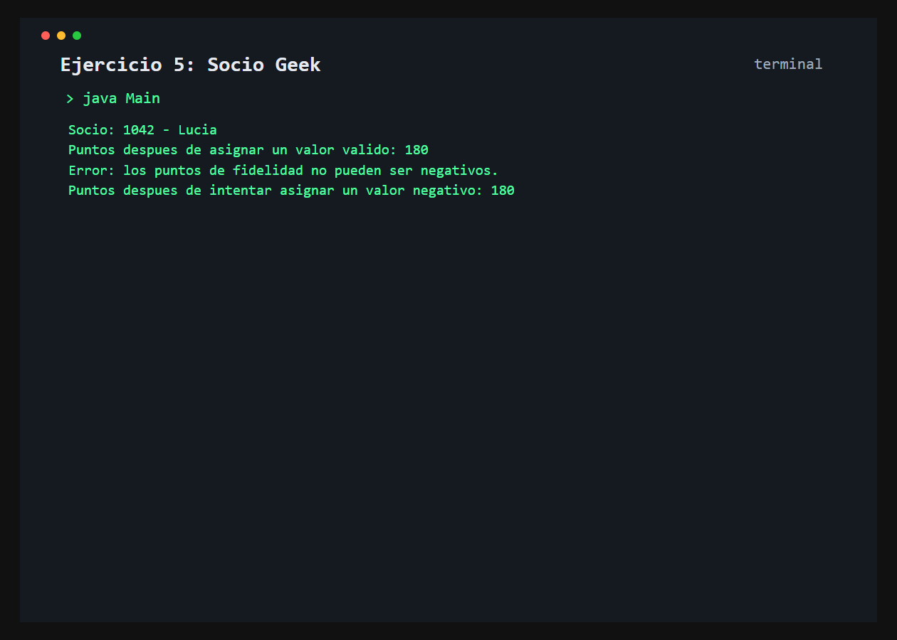

# Ejercicio 5: SocioGeek

    /------------------------------------------\
    | Encapsulamiento y validacion             |
    \------------------------------------------/

## Descripción

Un socio geek tiene un numero de socio, un nombre y puntos de fidelidad protegidos como atributos privados.

## Objetivo

Aplicar ocultamiento de datos mediante `private`, getters y un setter que valida los puntos antes de modificarlos.

## Como funciona

El programa asigna primero puntos validos y despues intenta asignar un valor negativo. El setter rechaza el segundo valor y mantiene el estado anterior.



## Lógica aplicada

- Atributos privados
- Constructor parametrizado
- Getters para consultar los datos
- Validacion defensiva en `setPuntosFidelidad()`

## Código principal

```java
SocioGeek socio = new SocioGeek(1042, "Lucia", 120);
socio.setPuntosFidelidad(180);
socio.setPuntosFidelidad(-25);
System.out.println(socio.getPuntosFidelidad());
```

## Ejecución

```bash
javac src/*.java
java -cp src Main
```