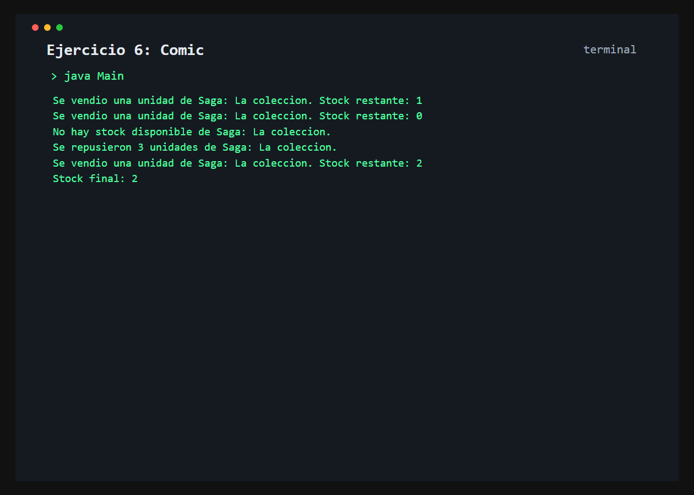

# Ejercicio 6: Comic

    /------------------------------------------\
    | Stock e invariantes                      |
    \------------------------------------------/

## Descripción

La clase `Comic` administra titulo, precio y stock, protegiendo la cantidad disponible mediante operaciones de negocio.

## Objetivo

Preservar invariantes del objeto y evitar que las ventas reduzcan el stock por debajo de cero.

## Como funciona

Se venden las dos unidades disponibles, se intenta una venta sin stock, se reponen unidades y se realiza otra venta.



## Lógica aplicada

- Constructor con validacion de precio y stock
- Atributos privados y getters
- Setter de precio sin setter directo de stock
- Reposicion positiva mediante `reponerStock()`
- Venta controlada con `venderUnidad()`

## Código principal

```java
Comic comic = new Comic("Saga: La coleccion", 9500.0, 2);
comic.venderUnidad();
comic.venderUnidad();
comic.venderUnidad();
comic.reponerStock(3);
```

## Ejecución

```bash
javac src/*.java
java -cp src Main
```