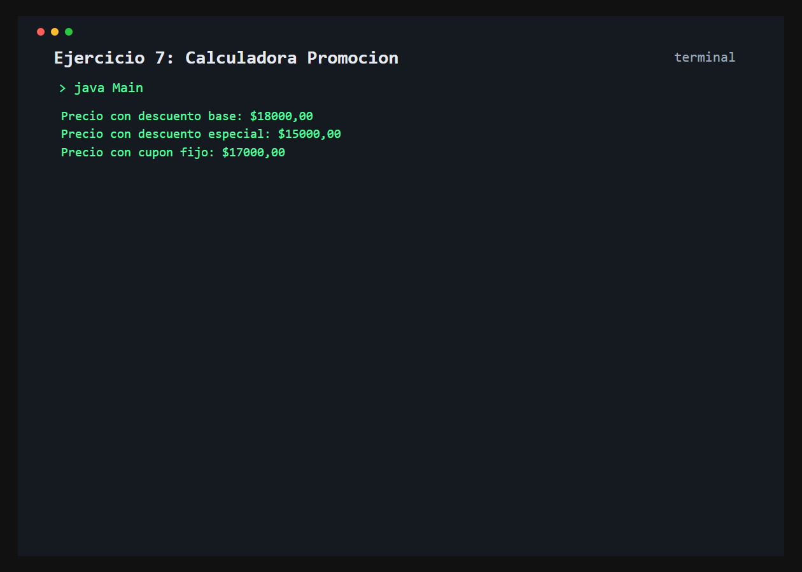

# Ejercicio 7: CalculadoraPromocion

    /------------------------------------------\
    | Sobrecarga de metodos                    |
    \------------------------------------------/

## Descripción

La calculadora obtiene el precio final aplicando un descuento porcentual base, un porcentaje especial o un cupon de monto fijo.

## Objetivo

Comprender la sobrecarga de metodos y como Java selecciona una firma segun los tipos de los argumentos.

## Como funciona

Se invocan las tres versiones de `calcularPrecioFinal()`: sin segundo argumento, con un `double` para el porcentaje especial y con un `int` para el cupon fijo.



## Lógica aplicada

- Metodo sobrecargado con distintas firmas
- Descuento porcentual base
- Descuento porcentual enviado por parametro
- Descuento de monto fijo con cupon

## Código principal

```java
calculadora.calcularPrecioFinal(precioBase);
calculadora.calcularPrecioFinal(precioBase, 25.0);
calculadora.calcularPrecioFinal(precioBase, 3000);
```

## Ejecución

```bash
javac src/*.java
java -cp src Main
```