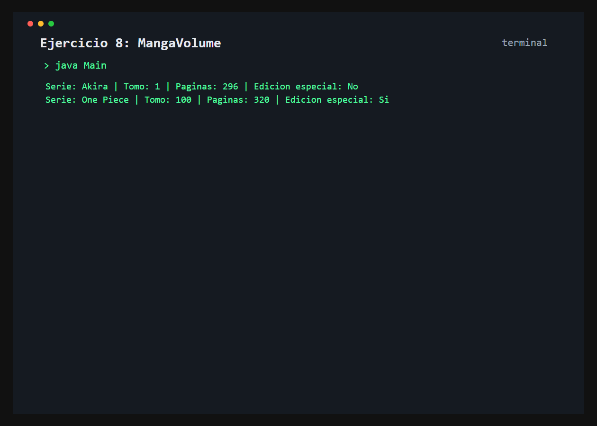

# Ejercicio 8: MangaVolume

    /------------------------------------------\
    | Representacion de un volumen             |
    \------------------------------------------/

## Descripción

`MangaVolume` representa un tomo mediante su serie, numero y cantidad de paginas, e informa si es una edicion especial.

## Objetivo

Sobrescribir `toString()` y modularizar una regla interna mediante un metodo auxiliar privado.

## Como funciona

Se crean dos tomos y se imprimen directamente. Un tomo con mas de 300 paginas se considera una edicion especial.



## Lógica aplicada

- Metodo publico `esEdicionEspecial()`
- Metodo auxiliar privado `esTomoExtenso()`
- Sobrescritura de `toString()`
- Impresion directa del objeto

## Código principal

```java
MangaVolume manga = new MangaVolume("One Piece", 100, 320);
System.out.println(manga);
```

## Ejecución

```bash
javac src/*.java
java -cp src Main
```