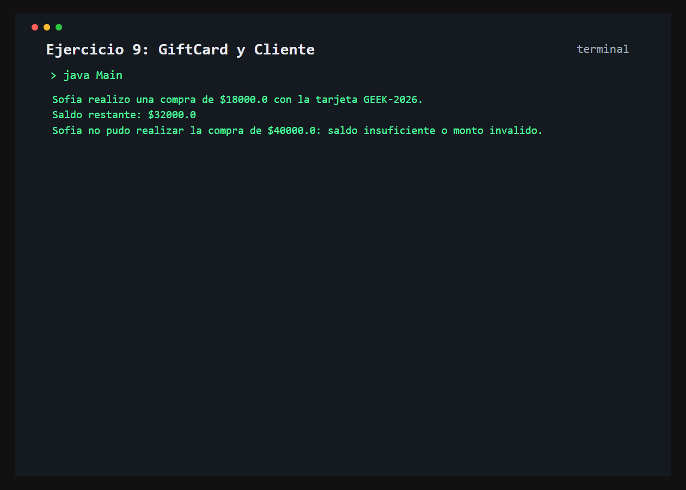

# Ejercicio 9: GiftCard y Cliente

    /------------------------------------------\
    | Interaccion entre objetos                |
    \------------------------------------------/

## Descripción

Un cliente realiza compras mediante una tarjeta de regalo que administra su codigo y saldo.

## Objetivo

Practicar el envio de mensajes entre objetos y el uso de una referencia a otro objeto como atributo.

## Como funciona

El cliente usa su GiftCard para realizar una compra exitosa y luego intenta una segunda compra cuyo importe supera el saldo disponible.



## Lógica aplicada

- Atributos privados en `GiftCard`
- Descuento de saldo con resultado booleano
- Referencia `GiftCard` almacenada en `Cliente`
- Compra aceptada o rechazada segun el saldo

## Código principal

```java
GiftCard tarjeta = new GiftCard("GEEK-2026", 50000.0);
Cliente cliente = new Cliente("Sofia", tarjeta);
cliente.realizarCompra(18000.0);
cliente.realizarCompra(40000.0);
```

## Ejecución

```bash
javac src/*.java
java -cp src Main
```